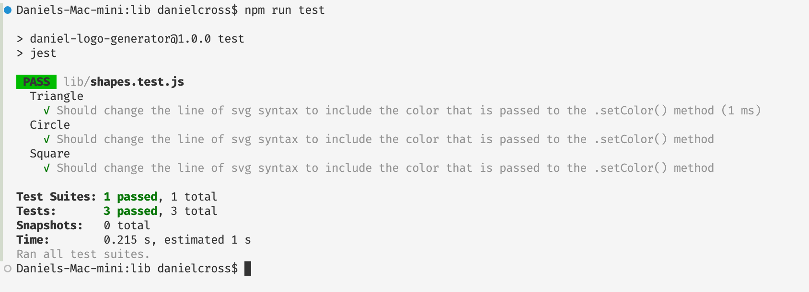

# Daniel's Logo Generator

## 

## Description

This app was made in order to simplify the process of creating a simple .svg logo, especially for freelance developers. Understanding .svg syntax and creating even a simple logo might be beyond many users' pay-grade. Giving users a way of simply describing what they would like the logo to look like eliminates the need for this technical knowledge, or perhaps the need to pay a graphic designer.

This logo generator allows for the following specifications for the logo:

- Choice between a simple square, triangle, or circle logo
- Choice of color of the shape
- Custom 3-character text-input for logo
- Choice of color of the text

Through the process of creating this app, I learned and/or practiced the following skills:

- Node.js server-side app development
- Gaining some familiarity with SVG syntax
- Creating tests for code using the Jest Testing Framework
- Using ES6 'class' syntax to create objects with parent-child relationships that use protoype inheritance to share properties and methods.
- Using 'modularization': separating different classes/methods into different files that can be imported/exported where each class's functionality needs to be called upon
- Importing 3rd-party modules 'Jest' and 'Inquirer' using npm; using native node module 'fs'

## Table of Contents

- [Installation](#installation)
- [Usage](#usage)
- [Contributions](#contributions)
- [License](#license)

## Installation

You can either clone the repository or download the zip from my GitHub:
[daniel-logo-generator](https://github.com/danrcross/daniel-logo-generator)

## Usage

[Click here to view a video demonstrating both the testing and functionality of the app](https://drive.google.com/file/d/1c7nf8CbDnebphhVbBg6h88qewtGdJJFc/view?usp=sharing)

## License

This application is covered under the [MIT](https://opensource.org/licenses/MIT) license.

## Contributions

No starter code was used.

SVG info gleaned from MDN's [SVG Tutorial article](https://developer.mozilla.org/en-US/docs/Web/SVG/Tutorial)

[Inquirer documentation](https://www.npmjs.com/package/inquirer) was helpful; filter function explained.

## Tests

[Jest Testing Framework](https://jestjs.io/) was used for testing in this app.

To run a test on the functionality of the Triangle, Circle, and Square classes/modules, open an integrated terminal from within the 'lib' directory:

Then, type `npm run test` in the command line, and press enter:

The tests should all pass, and should display in your terminal like this:

Any additional tests that you may like to create can be added to the [shapes.test.js file](lib/shapes.test.js).

## Questions

Any Questions? Click a link below to visit my GitHub and/or email me!

For emails, please use this format in the subject line: 'GitHub: {NAME_OF_REPOSITORY}'

[GitHub](https://github.com/danrcross)

[Email](mailto:danrcross@gmail.com)
